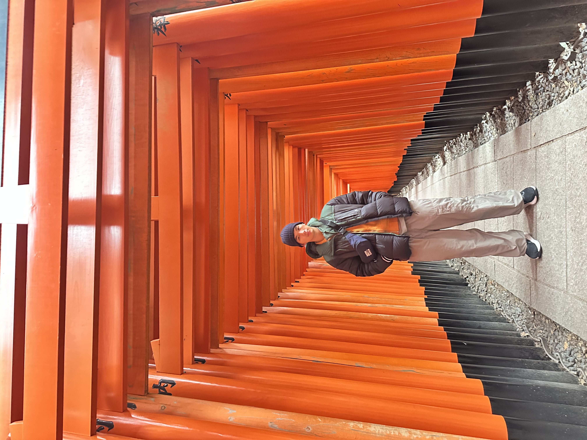

# Darian's User Page

**Welcome to my GitHub Page!**
Hello, I'm a 3rd year transfer at UCSD studying Computer Science, this page will tell you about me and my interests

## Table of Contents
- <ins>[About Me](#about-me)</ins>
- <ins>[Favorite Quote](#favorite-quote)</ins>
- <ins>[Code Sample](#code-sample)</ins>
- <ins>[Contact Me](#projects)</ins>

## About Me
I'm a Computer Science Student at UCSD and I know C++, C, Python, Javascript, and HTML. When I'm not doing anything coding related I enjoy:
1. Reading
2. Playing Volleyball
3. Making Music on Ableton
4. Cooking
5. Traveling

A picture of me in Japan


I'm trying to improve on some things on my hobbies, this is a list of some of them:

- [x] Recieve properly in volleyball
- [ ] Spike properly in volleyball
- [ ] Finish the song
- [x] Cook [Soto Betawi](./IMG_5691.jpeg)

## Favorite Quote
> The only safe thing is to take a chance.
– Mike Nichols

## Code Sample
A Hello World program in Python
```
print("Hello World")
```

## Contact Me
The best way to contact me is through email

Email: [dariantan7@gmail.com](mailto:dariantan7@gmail.com)

[My Linkedin](https://www.linkedin.com/in/darian-tan/)

[GitHub profile](https://github.com/darkotoni)


